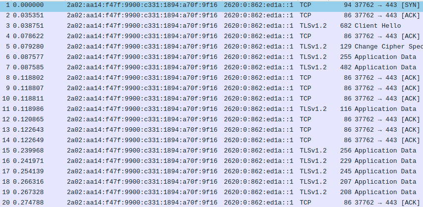
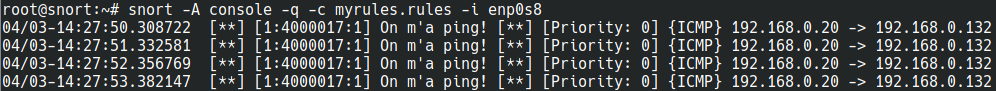
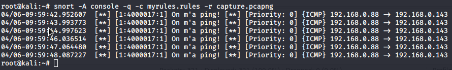
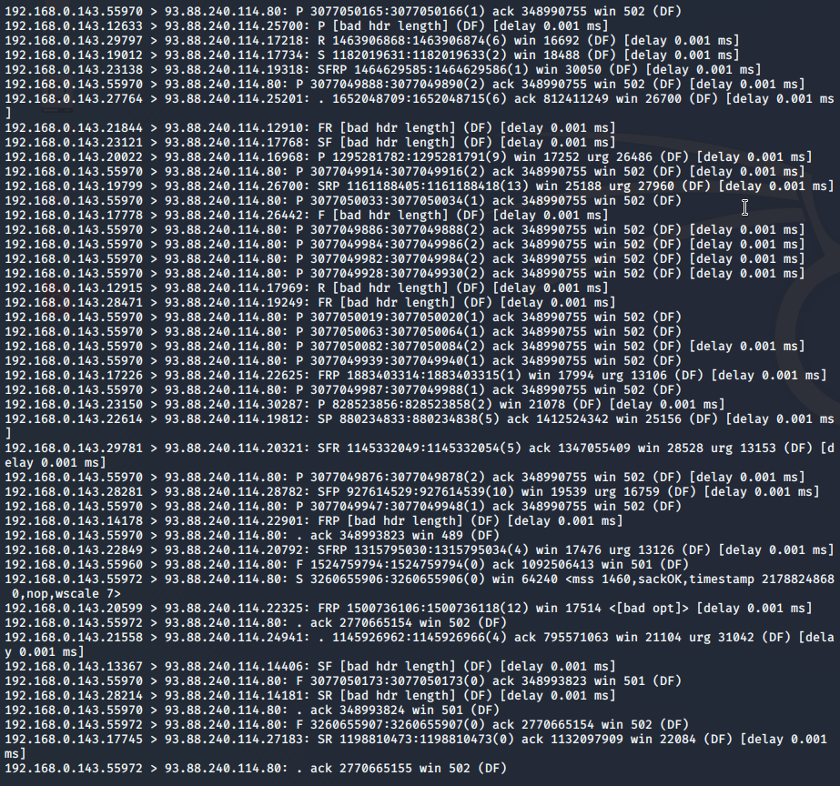

Auteurs : Gil Balsiger et Julien Béguin

# Teaching-HEIGVD-SRX-2020-Laboratoire-IDS

**Ce travail de laboratoire est à faire en équipes de 2 personnes** (oui... en remote...). Je vous laisse vous débrouiller ;-)

**ATTENTION : Commencez par créer un Fork de ce repo et travaillez sur votre fork.**

Clonez le repo sur votre machine. Vous pouvez répondre aux questions en modifiant directement votre clone du README.md ou avec un fichier pdf que vous pourrez uploader sur votre fork.

**Le rendu consiste simplement à répondre à toutes les questions clairement identifiées dans le text avec la mention "Question" et à les accompagner avec des captures. Le rendu doit se faire par une "pull request". Envoyer également le hash du dernier commit et votre username GitHub par email au professeur et à l'assistant**

## Table de matières

[Introduction](#introduction)

[Echéance](#echéance)

[Configuration du réseau](#configuration-du-réseau-sur-virtualbox)

[Installation de Snort](#installation-de-snort-sur-linux)

[Essayer Snort](#essayer-snort)

[Utilisation comme IDS](#utilisation-comme-un-ids)

[Ecriture de règles](#ecriture-de-règles)

[Travail à effectuer](#exercises)


## Echéance 

Ce travail devra être rendu le dimanche après la fin de la 2ème séance de laboratoire, soit au plus tard, **le 6 avril 2020, à 23h59.**


## Introduction

Dans ce travail de laboratoire, vous allez explorer un système de detection contre les intrusions (IDS) dont l'utilisation es très répandue grace au fait qu'il est gratuit et open source. Il s'appelle [Snort](https://www.snort.org). Il existe des versions de Snort pour Linux et pour Windows.

### Les systèmes de detection d'intrusion

Un IDS peut "écouter" tout le traffic de la partie du réseau où il est installé. Sur la base d'une liste de règles, il déclenche des actions sur des paquets qui correspondent à la description de la règle.

Un exemple de règle pourrait être, en language commun : "donner une alerte pour tous les paquets envoyés par le port http à un serveur web dans le réseau, qui contiennent le string 'cmd.exe'". En on peut trouver des règles très similaires dans les règles par défaut de Snort. Elles permettent de détecter, par exemple, si un attaquant essaie d'executer un shell de commandes sur un serveur Web tournant sur Windows. On verra plus tard à quoi ressemblent ces règles.

Snort est un IDS très puissant. Il est gratuit pour l'utilisation personnelle et en entreprise, où il est très utilisé aussi pour la simple raison qu'il est l'un des plus efficaces systèmes IDS.

Snort peut être exécuté comme un logiciel indépendant sur une machine ou comme un service qui tourne après chaque démarrage. Si vous voulez qu'il protège votre réseau, fonctionnant comme un IPS, il faudra l'installer "in-line" avec votre connexion Internet. 

Par exemple, pour une petite entreprise avec un accès Internet avec un modem simple et un switch interconnectant une dizaine d'ordinateurs de bureau, il faudra utiliser une nouvelle machine executant Snort et placée entre le modem et le switch. 


## Matériel

Vous avez besoin de votre ordinateur avec VirtualBox et une VM Kali Linux. Vous trouverez un fichier OVA pour la dernière version de Kali sur `//eistore1/cours/iict/Laboratoires/SRX/Kali` si vous en avez besoin.


## Configuration du réseau sur VirtualBox

Votre VM fonctionnera comme IDS pour "protéger" votre machine hôte (par exemple, si vous faites tourner VirtualBox sur une machine Windows, Snort sera utilisé pour capturer le trafic de Windows vers l'Internet).

Pour cela, il faudra configurer une réseau de la VM en mode "bridge" et activer l'option "Promiscuous Mode" dans les paramètres avancés de l'interface. Le mode bridge dans l'école ne vous permet pas d'accéder à l'Internet depuis votre VM. Vous pouvez donc rajouter une deuxième interface réseau à votre Kali configurée comme NAT. La connexion Internet est indispensable pour installer Snort mais pas vraiment nécessaire pour les manipulations du travail pratique.

Pour les captures avec Snort, assurez-vous de toujours indiquer la bonne interface dans la ligne de commandes, donc, l'interface configurée en mode promiscuous.


## Installation de Snort sur Linux

On va installer Snort sur Kali Linux. Si vous avez déjà une VM Kali, vous pouvez l'utiliser. Sinon, vous avez la possibilité de copier celle sur `eistore`.

La manière la plus simple c'est de d'installer Snort en ligne de commandes. Il suffit d'utiliser la commande suivante :

```
sudo apt update && apt install snort
```

Ceci télécharge et installe la version la plus récente de Snort.

Vers la fin de l'installation, on vous demande de fournir l'adresse de votre réseau HOME. Il s'agit du réseau que vous voulez protéger. Cela sert à configurer certaines variables pour Snort. Pour les manipulations de ce laboratoire, vous pouvez donner n'importe quelle adresse comme réponse.


## Essayer Snort

Une fois installé, vous pouvez lancer Snort comme un simple "sniffer". Pourtant, ceci capture tous les paquets, ce qui peut produire des fichiers de capture énormes si vous demandez de les journaliser. Il est beaucoup plus efficace d'utiliser des règles pour définir quel type de trafic est intéressant et laisser Snort ignorer le reste.

Snort se comporte de différentes manières en fonction des options que vous passez en ligne de commande au démarrage. Vous pouvez voir la grande liste d'options avec la commande suivante :

```
snort --help
```

On va commencer par observer tout simplement les entêtes des paquets IP utilisant la commande :

```
snort -v -i eth0
```

**ATTENTION : assurez-vous de bien choisir l'interface qui se trouve en mode bridge/promiscuous. Elle n'est peut-être pas eth0 chez-vous!**

Snort s'execute donc et montre sur l'écran tous les entêtes des paquets IP qui traversent l'interface eth0. Cette interface est connectée à l'interface réseau de votre machine hôte à travers le bridge de VirtualBox.

Pour arrêter Snort, il suffit d'utiliser `CTRL-C` (**attention** : il peut arriver de temps à autres que snort ne réponde pas correctement au signal d'arrêt. Dans ce cas-là, il faudra utiliser `kill` pour arrêter le process).

## Utilisation comme un IDS

Pour enregistrer seulement les alertes et pas tout le trafic, on execute Snort en mode IDS. Il faudra donc spécifier un fichier contenant des règles. 

Il faut noter que `/etc/snort/snort.config` contient déjà des références aux fichiers de règles disponibles avec l'installation par défaut. Si on veut tester Snort avec des règles simples, on peut créer un fichier de config personnalisé (par exemple `mysnort.conf`) et importer un seul fichier de règles utilisant la directive "include".

Les fichiers de règles sont normalement stockes dans le repertoire `/etc/snort/rules/`, mais en fait un fichier de config et les fichiers de règles peuvent se trouver dans n'importe quel repertoire. 

Par exemple, créez un fichier de config `mysnort.conf` dans le repertoire `/etc/snort` avec le contenu suivant :

```
include /etc/snort/rules/icmp2.rules
```

Ensuite, créez le fichier de règles `icmp2.rules` dans le repertoire `/etc/snort/rules/` et rajoutez dans ce fichier le contenu suivant :

`alert icmp any any -> any any (msg:"ICMP Packet"; sid:4000001; rev:3;)`

On peut maintenant executer la commande :

```
snort -c /etc/snort/mysnort.conf
```

Vous pouvez maintenant faire quelques pings depuis votre hôte et regarder les résultas dans le fichier d'alertes contenu dans le repertoire `/var/log/snort/`. 


## Ecriture de règles

Snort permet l'écriture de règles qui décrivent des tentatives de exploitation de vulnérabilités bien connues. Les règles Snort prennent en charge à la fois, l'analyse de protocoles et la recherche et identification de contenu.

Il y a deux principes de base à respecter :

* Une règle doit être entièrement contenue dans une seule ligne
* Les règles sont divisées en deux sections logiques : (1) l'entête et (2) les options.

L'entête de la règle contient l'action de la règle, le protocole, les adresses source et destination, et les ports source et destination.

L'option contient des messages d'alerte et de l'information concernant les parties du paquet dont le contenu doit être analysé. Par exemple:

```
alert tcp any any -> 192.168.1.0/24 111 (content:"|00 01 86 a5|"; msg: "mountd access";)
```

Cette règle décrit une alerte générée quand Snort trouve un paquet avec tous les attributs suivants :

* C'est un paquet TCP
* Emis depuis n'importe quelle adresse et depuis n'importe quel port
* A destination du réseau identifié par l'adresse 192.168.1.0/24 sur le port 111

Le text jusqu'au premier parenthèse est l'entête de la règle. 

```
alert tcp any any -> 192.168.1.0/24 111
```

Les parties entre parenthèses sont les options de la règle:

```
(content:"|00 01 86 a5|"; msg: "mountd access";)
```

Les options peuvent apparaître une ou plusieurs fois. Par exemple :

```
alert tcp any any -> any 21 (content:"site exec"; content:"%"; msg:"site
exec buffer overflow attempt";)
```

La clé "content" apparait deux fois parce que les deux strings qui doivent être détectés n'apparaissent pas concaténés dans le paquet mais à des endroits différents. Pour que la règle soit déclenchée, il faut que le paquet contienne **les deux strings** "site exec" et "%". 

Les éléments dans les options d'une règle sont traitées comme un AND logique. La liste complète de règles sont traitées comme une succession de OR.

## Informations de base pour le règles

### Actions :

```
alert tcp any any -> any any (msg:"My Name!"; content:"Skon"; sid:1000001; rev:1;)
```

L'entête contient l'information qui décrit le "qui", le "où" et le "quoi" du paquet. Ça décrit aussi ce qui doit arriver quand un paquet correspond à tous les contenus dans la règle.

Le premier champ dans le règle c'est l'action. L'action dit à Snort ce qui doit être fait quand il trouve un paquet qui correspond à la règle. Il y a six actions :

* alert - générer une alerte et écrire le paquet dans le journal
* log - écrire le paquet dans le journal
* pass - ignorer le paquet
* drop - bloquer le paquet et l'ajouter au journal
* reject - bloquer le paquet, l'ajouter au journal et envoyer un `TCP reset` si le protocole est TCP ou un `ICMP port unreachable` si le protocole est UDP
* sdrop - bloquer le paquet sans écriture dans le journal

### Protocoles :

Le champ suivant c'est le protocole. Il y a trois protocoles IP qui peuvent être analysez par Snort : TCP, UDP et ICMP.


### Adresses IP :

La section suivante traite les adresses IP et les numéros de port. Le mot `any` peut être utilisé pour définir "n'import quelle adresse". On peut utiliser l'adresse d'une seule machine ou un block avec la notation CIDR. 

Un opérateur de négation peut être appliqué aux adresses IP. Cet opérateur indique à Snort d'identifier toutes les adresses IP sauf celle indiquée. L'opérateur de négation est le `!`.

Par exemple, la règle du premier exemple peut être modifiée pour alerter pour le trafic dont l'origine est à l'extérieur du réseau :

```
alert tcp !192.168.1.0/24 any -> 192.168.1.0/24 111
(content: "|00 01 86 a5|"; msg: "external mountd access";)
```

### Numéros de Port :

Les ports peuvent être spécifiés de différentes manières, y-compris `any`, une définition numérique unique, une plage de ports ou une négation.

Les plages de ports utilisent l'opérateur `:`, qui peut être utilisé de différentes manières aussi :

```
log udp any any -> 192.168.1.0/24 1:1024
```

Journaliser le traffic UDP venant d'un port compris entre 1 et 1024.

--

```
log tcp any any -> 192.168.1.0/24 :6000
```

Journaliser le traffic TCP venant d'un port plus bas ou égal à 6000.

--

```
log tcp any :1024 -> 192.168.1.0/24 500:
```

Journaliser le traffic TCP venant d'un port privilégié (bien connu) plus grand ou égal à 500 mais jusqu'au port 1024.


### Opérateur de direction

L'opérateur de direction `->`indique l'orientation ou la "direction" du trafique. 

Il y a aussi un opérateur bidirectionnel, indiqué avec le symbole `<>`, utile pour analyser les deux côtés de la conversation. Par exemple un échange telnet :

```
log 192.168.1.0/24 any <> 192.168.1.0/24 23
```

## Alertes et logs Snort

Si Snort détecte un paquet qui correspond à une règle, il envoie un message d'alerte ou il journalise le message. Les alertes peuvent être envoyées au syslog, journalisées dans un fichier text d'alertes ou affichées directement à l'écran.

Le système envoie **les alertes vers le syslog** et il peut en option envoyer **les paquets "offensifs" vers une structure de repertoires**.

Les alertes sont journalisées via syslog dans le fichier `/var/log/snort/alerts`. Toute alerte se trouvant dans ce fichier aura son paquet correspondant dans le même repertoire, mais sous le fichier `snort.log.xxxxxxxxxx` où `xxxxxxxxxx` est l'heure Unix du commencement du journal.

Avec la règle suivante :

```
alert tcp any any -> 192.168.1.0/24 111
(content:"|00 01 86 a5|"; msg: "mountd access";)
```

un message d'alerte est envoyé à syslog avec l'information "mountd access". Ce message est enregistré dans `/var/log/snort/alerts` et le vrai paquet responsable de l'alerte se trouvera dans un fichier dont le nom sera `/var/log/snort/snort.log.xxxxxxxxxx`.

Les fichiers log sont des fichiers binaires enregistrés en format pcap. Vous pouvez les ouvrir avec Wireshark ou les diriger directement sur la console avec la commande suivante :

```
tcpdump -r /var/log/snort/snort.log.xxxxxxxxxx
```

Vous pouvez aussi utiliser des captures Wireshark ou des fichiers snort.log.xxxxxxxxx comme source d'analyse por Snort.

## Exercises

**Réaliser des captures d'écran des exercices suivants et les ajouter à vos réponses.**

### Essayer de répondre à ces questions en quelques mots :

**Question 1: Qu'est ce que signifie les "preprocesseurs" dans le contexte de Snort ?**

---

**Reponse :**  Les préprocesseurs permettent aux utilisateurs d'étendre les fonctionnalités de Snort facilement de manières modulaire. Avec ces préprocesseurs, les paquets peuvent être analysés et modifiés.

---

**Question 2: Pourquoi êtes vous confronté au WARNING suivant `"No preprocessors configured for policy 0"` lorsque vous exécutez la commande `snort` avec un fichier de règles ou de configuration "home-made" ?**

---

**Reponse :**  Étant donné que notre configuration est quasi vierge, aucun préprocesseur n'a été configuré. Il est possible de rajouter des préprocesseurs à la configuration de Snort de la manière suivante :

```
preprocessor <name>: <options>
```

---

--

### Trouver votre nom :

Considérer la règle simple suivante:

alert tcp any any -> any any (msg:"Mon nom!"; content:"Rubinstein"; sid:4000015; rev:1;)

**Question 3: Qu'est-ce qu'elle fait la règle et comment ça fonctionne ?**

---

**Reponse :**  Cette règle alerte si un paquet TCP contient "Rubinstein". Le paquet en question peut venir de n'importe quelle adresse et utiliser n'importe quel port et aller vers n'importe quelle adresse sur n'importe quel port.

---

Utiliser un éditeur et créer un fichier `myrules.rules` sur votre répertoire home. Rajouter une règle comme celle montrée avant mais avec votre nom ou un mot clé de votre préférence. Lancer snort avec la commande suivante :

```
sudo snort -c myrules.rules -i eth0
```

**Question 4: Que voyez-vous quand le logiciel est lancé ? Qu'est-ce que tous les messages affichés veulent dire ?**

---

**Reponse :**  Il s'affiche les mêmes messages qu'à la question 2. Soit des `No preprocessors configured for policy 0` à répétition.

---

Aller à un site web contenant dans son text votre nom ou votre mot clé que vous avez choisi (il faudra chercher un peu pour trouver un site en http...).

**Question 5: Que voyez-vous sur votre terminal quand vous visitez le site ?**

---

**Reponse :**  Rien de particulier, les message sont les mêmes qu'à la question 4. C'est parce que les alertes vont dans le fichier `/var/log/snort/alert` et pas dans la console. Il est possible de les afficher dans la console avec l'option Snort `-A console`.

---

Arrêter Snort avec `CTRL-C`.

**Question 6: Que voyez-vous quand vous arrêtez snort ? Décrivez en détail toutes les informations qu'il vous fournit.**

---

**Reponse :**  

```
===============================================================================
Run time for packet processing was 9.135840 seconds
Snort processed 166 packets.
Snort ran for 0 days 0 hours 0 minutes 9 seconds
   Pkts/sec:           18
===============================================================================
Memory usage summary:
  Total non-mmapped bytes (arena):       2293760
  Bytes in mapped regions (hblkhd):      17252352
  Total allocated space (uordblks):      2070176
  Total free space (fordblks):           223584
  Topmost releasable block (keepcost):   66688
===============================================================================
Packet I/O Totals:
   Received:          170
   Analyzed:          166 ( 97.647%)
    Dropped:            0 (  0.000%)
   Filtered:            0 (  0.000%)
Outstanding:            4 (  2.353%)
   Injected:            0
===============================================================================
Breakdown by protocol (includes rebuilt packets):
        Eth:          166 (100.000%)
       VLAN:            0 (  0.000%)
        IP4:          119 ( 71.687%)
       Frag:            0 (  0.000%)
       ICMP:            0 (  0.000%)
        UDP:           24 ( 14.458%)
        TCP:           92 ( 55.422%)
        IP6:           38 ( 22.892%)
    IP6 Ext:           43 ( 25.904%)
   IP6 Opts:            5 (  3.012%)
      Frag6:            0 (  0.000%)
      ICMP6:            8 (  4.819%)
       UDP6:            6 (  3.614%)
       TCP6:           24 ( 14.458%)
     Teredo:            0 (  0.000%)
    ICMP-IP:            0 (  0.000%)
    IP4/IP4:            0 (  0.000%)
    IP4/IP6:            0 (  0.000%)
    IP6/IP4:            0 (  0.000%)
    IP6/IP6:            0 (  0.000%)
        GRE:            0 (  0.000%)
    GRE Eth:            0 (  0.000%)
   GRE VLAN:            0 (  0.000%)
    GRE IP4:            0 (  0.000%)
    GRE IP6:            0 (  0.000%)
GRE IP6 Ext:            0 (  0.000%)
   GRE PPTP:            0 (  0.000%)
    GRE ARP:            0 (  0.000%)
    GRE IPX:            0 (  0.000%)
   GRE Loop:            0 (  0.000%)
       MPLS:            0 (  0.000%)
        ARP:            9 (  5.422%)
        IPX:            0 (  0.000%)
   Eth Loop:            0 (  0.000%)
   Eth Disc:            0 (  0.000%)
   IP4 Disc:            3 (  1.807%)
   IP6 Disc:            0 (  0.000%)
   TCP Disc:            0 (  0.000%)
   UDP Disc:            0 (  0.000%)
  ICMP Disc:            0 (  0.000%)
All Discard:            3 (  1.807%)
      Other:            0 (  0.000%)
Bad Chk Sum:            3 (  1.807%)
    Bad TTL:            0 (  0.000%)
     S5 G 1:            0 (  0.000%)
     S5 G 2:            0 (  0.000%)
      Total:          166
===============================================================================
Action Stats:
     Alerts:           17 ( 10.241%)
     Logged:           17 ( 10.241%)
     Passed:            0 (  0.000%)
Limits:
      Match:            0
      Queue:            0
        Log:            0
      Event:            0
      Alert:            0
Verdicts:
      Allow:          166 ( 97.647%)
      Block:            0 (  0.000%)
    Replace:            0 (  0.000%)
  Whitelist:            0 (  0.000%)
  Blacklist:            0 (  0.000%)
     Ignore:            0 (  0.000%)
      Retry:            0 (  0.000%)
===============================================================================
```

La première partie indique combien de temps Snort à fonctionné, le nombre de paquets analysés ainsi que le nombre de paquets par seconde.

La deuxième partie indique l'utilisation de la mémoire.

La troisième partie montre les paquets reçus, analysés, annulé etc... ainsi que leur pourcentage par rapport au nombre total de paquets reçus.

La quatrième partie regroupe les paquets par protocole.

La cinquième partie montre les statistiques de la session soit le nombre d'alerte, de log et le nombre de paquets autorisés, rejetés, etc...

---


Aller au répertoire /var/log/snort. Ouvrir le fichier `alert`. Vérifier qu'il y ait des alertes pour votre nom ou mot choisi.

**Question 7: A quoi ressemble l'alerte ? Qu'est-ce que chaque élément de l'alerte veut dire ? Décrivez-la en détail !**

---

**Reponse :**  

```
[**] [1:4000015:1] Mon nom! [**]
[Priority: 0] 
04/03-13:07:03.485390 192.168.0.132:60944 -> 93.88.240.114:80
TCP TTL:64 TOS:0x0 ID:8891 IpLen:20 DgmLen:483 DF
***AP*** Seq: 0x48324AED  Ack: 0x2FE6244C  Win: 0x1F6  TcpLen: 20

[**] [1:4000015:1] Mon nom! [**]
[Priority: 0] 
04/03-13:07:03.578513 192.168.0.132:60944 -> 93.88.240.114:80
TCP TTL:64 TOS:0x0 ID:8894 IpLen:20 DgmLen:498 DF
***AP*** Seq: 0x48324CA8  Ack: 0x2FE63E4A  Win: 0x1F5  TcpLen: 20

[**] [1:4000015:1] Mon nom! [**]
[Priority: 0] 
04/03-13:07:03.601567 192.168.0.132:60944 -> 93.88.240.114:80
TCP TTL:64 TOS:0x0 ID:8896 IpLen:20 DgmLen:494 DF
***AP*** Seq: 0x48324E72  Ack: 0x2FE63EF0  Win: 0x1F5  TcpLen: 20
```

- `[**] [1:4000015:1] Mon nom! [**]`: identifiant de la règle, on y retrouve le sid, le numéro de révision ainsi que le contenu du message.
- `[Priority: 0] `: La priorité de la règle, à 0 par défaut si elle n'a pas été définie.
- `04/03-13:07:03.485390`: date et heure précise de l'alerte.
- `192.168.0.132:60944 -> 93.88.240.114:80`: IP et port source ainsi que l'IP et port de destination.

- `TCP TTL:64 TOS:0x0 ID:8891 IpLen:20 DgmLen:483 DF`: Informations de [l'entête du paquet IP](https://en.wikipedia.org/wiki/IPv4#Packet_structure): 
  - le protocole (ici TCP),
  - le time to live (TTL),
  - type of service (TOS),
  - identifiant du paquet (ID)
  - taille de l'entête du paquet IP (IpLen)
  - taille du paquet IP complet (entête et données) (DgmLen)
- `***AP*** Seq: 0x48324AED  Ack: 0x2FE6244C  Win: 0x1F6  TcpLen: 20`: Informations de [l'entête du segment TCP](https://en.wikipedia.org/wiki/Transmission_Control_Protocol#TCP_segment_structure):
  - numéro de séquence (Seq),
  - numéro d'acquittement (Ack),
  - taille de la fenêtre (Win),
  - taille de l'entête du segment TCP (TcpLen).

---

--

### Detecter une visite à Wikipedia

Ecrire une règle qui journalise (sans alerter) un message à chaque fois que Wikipedia est visité **DEPUIS VOTRE** station. **Ne pas utiliser une règle qui détecte un string ou du contenu**.

**Question 8: Quelle est votre règle ? Où le message a-t'il été journalisé ? Qu'est-ce qui a été journalisé ?**

---

**Reponse :** 

> Quelle est votre règle ?

La régle est la suivante :

```
log tcp any any -> [2620:0:862:ed1a::1] any (msg:"Wikipedia!";sid:40000016;rev:1;)
```

`2620:0:862:ed1a::1` étant l'adresse IPv6 de [wikipedia.org](wikipedia.org).

> Où le message a-t'il été journalisé ?

Les logs ont été écrit dans `/var/log/snort/snort.log.1585922555`.

> Qu'est-ce qui a été journalisé ?

Uniquement les paquets TCP à destination de `2620:0:862:ed1a::1`.

Ci-dessous, un extrait des logs vu dans Wireshark:



---

--

### Detecter un ping d'un autre système

Écrire une règle qui alerte à chaque fois que votre système reçoit un ping depuis une autre machine (je sais que la situation actuelle du Covid-19 ne vous permet pas de vous mettre ensemble... utilisez votre imagination pour trouver la solution à cette question !). Assurez-vous que **ça n'alerte pas** quand c'est vous qui envoyez le ping vers un autre système !

**Question 9: Quelle est votre règle ?**

---

**Reponse :**  

```
alert icmp any any -> 192.168.0.132 any (msg:"On m'a ping!";itype:8;sid:4000017;rev:1;)
```

---


**Question 10: Comment avez-vous fait pour que ça identifie seulement les pings entrants ?**

---

**Reponse :**  Grâce à l'option `itype` qui permet de spécifier le type de paquet ICMP. 8 étant le numéro des echo request. On ne veut pas alerter pour les réponse ICMP (type 0).

---

**Question 11: Où le message a-t-il été journalisé ?**

---

**Reponse :**  Dans `/var/log/snort/alert`

---

**Question 12: Qu'est-ce qui a été journalisé ?**

---

**Reponse :**  

Voici le résultat si on décide de ne pas logguer les informations dans `/var/log/snort` mais directement dans la console.



---

--

### Detecter les ping dans les deux sens

Modifier votre règle pour que les pings soient détectés dans les deux sens.

**Question 13: Qu'est-ce que vous avez modifié pour que la règle détecte maintenant le trafic dans les deux sens ?**

---

**Reponse :**  On supprime l'option `itype`. Ainsi on alerte sur les requêtes et les réponses ICMP à destination de `192.168.0.132`. Si on ping et qu'on reçoit une réponse, on est alerté. Si on reçoit une request, on est alerté.

---


--

### Detecter une tentative de login SSH

Essayer d'écrire une règle qui Alerte qu'une tentative de session SSH a été faite depuis la machine d'un voisin (je sais que la situation actuelle du Covid-19 ne vous permet pas de vous mettre ensemble... utilisez votre imagination pour trouver la solution à cette question !). Si vous avez besoin de plus d'information sur ce qui décrit cette tentative (adresses, ports, protocoles), servez-vous de Wireshark pour analyser les échanges lors de la requête de connexion depuis votre voisin.

**Question 14: Quelle est votre règle ? Montrer la règle et expliquer en détail comment elle fonctionne.**

---

**Reponse :**  

```
alert tcp any any -> 192.168.0.132 22 (msg:"Connexion SSH!";flags:S;sid:4000018;rev:1;)
```

On alerte uniquement lorsque le flag TCP faut SYN, c'est-à-dire que la connexion est en train de ce faire. On n'est ainsi pas alerté des autres paquets SSH quand la connexion est bien effectuée.

---

**Question 15: Montrer le message d'alerte enregistré dans le fichier d'alertes.** 

---

**Reponse :**  

```
[**] [1:4000018:1] Connexion SSH! [**]
[Priority: 0] 
04/03-15:21:09.050189 192.168.0.20:65317 -> 192.168.0.132:22
TCP TTL:128 TOS:0x0 ID:59997 IpLen:20 DgmLen:52 DF
******S* Seq: 0x27595D07  Ack: 0x0  Win: 0xFAF0  TcpLen: 32
TCP Options (6) => MSS: 1460 NOP WS: 8 NOP NOP SackOK
```

---

--

### Analyse de logs

Lancer Wireshark et faire une capture du trafic sur l'interface connectée au bridge. Générez du trafic avec votre machine hôte qui corresponde à l'une des règles que vous avez ajouté à votre fichier de configuration personnel. Arrêtez la capture et enregistrez-la dans un fichier.

**Question 16: Quelle est l'option de Snort qui permet d'analyser un fichier pcap ou un fichier log ?**

---

**Reponse :**  L'option de Snort permettant d'analyser un fichier pcap ou pcapng est l'argument `-r <nom_du_fichier.pcap>`.

---

Utiliser l'option correcte de Snort pour analyser le fichier de capture Wireshark.

**Question 17: Quelle est le comportement de Snort avec un fichier de capture ? Y-a-t'il une difference par rapport à l'analyse en temps réel ?**

---

**Reponse :**  Il n'y a pas de réel différence entre le mode en temps réel et la lecture du fichier. L'analyse se fait de la même manière et l'affichage est identique.

Si on décide d'afficher les alertes directement dans la console, on peut observer le résultat suivant.



---

**Question 18: Est-ce que des alertes sont aussi enregistrées dans le fichier d'alertes?**

---

**Reponse :**  Oui l'enregistrement des log est toujours effectué dans le fichier `/var/log/snort/alert` si on ne précise pas l'option `-A console`.

---

--

### Contournement de la détection

Faire des recherches à propos des outils `fragroute` et `fragtest`.

**Question 20: A quoi servent ces deux outils ?**

---

**Reponse :**  

- **fragroute**:  permet d'intercepter, modifier et réécrire le trafic de sortie
- **fragtest**: permet de tester le comportement de ré-assemblage des fragments IP

> source: [https://tools.kali.org/information-gathering/fragroute](https://tools.kali.org/information-gathering/fragroute)

---

**Question 21: Quel est le principe de fonctionnement ?**

---

**Reponse :**  Ces outils proposent un ensemble de règles pour retarder, dupliquer, supprimer, fragmenter, chevaucher, imprimer, réorganiser, segmenter et autres mécanismes de modification des paquets sortant destinés à un hôte cible, avec un comportement potentiellement aléatoire ou probabiliste.

> source: [https://tools.kali.org/information-gathering/fragroute](https://tools.kali.org/information-gathering/fragroute)

---

**Question 22: Qu'est-ce que le `Frag3 Preprocessor` ? A quoi ça sert et comment ça fonctionne ?**

---

**Reponse :**  Le préprocesseur frag3 est un module de défragmentation IP basé sur cible pour Snort. Frag3 est conçu avec les objectifs suivants:

1. Une exécution plus rapide avec une gestion des données moins complexe.
2. Techniques anti-évasion de modélisation de l'hôte basées sur des cibles.

> source: https://www.snort.org/faq/readme-frag3

---


Reprendre l'exercice de la partie [Trouver votre nom](#trouver-votre-nom-). Essayer d'offusquer la détection avec `fragroute`.


**Question 23: Quel est le résultat de votre tentative ?**

---

**Reponse :**  

On peut voir ci-dessous l'activité de l’outil `fragroute`. En souhaitant atteindre [balsiger-architectes.ch](http://balsiger-architectes.ch), nous avons réussi à ne pas être détecté par l'IDS car aucune alerte n'est apparue dans le fichier des alertes (/var/log/snort/alert.conf).



---


Modifier le fichier `myrules.rules` pour que snort utiliser le `Frag3 Preprocessor` et refaire la tentative.

**Question 24: Quel est le résultat ?**

---

**Reponse :**  Afin d'activer le préprocesseur dans Snort. Nous avons rajouté les 2 lignes suivantes au début du fichier `myrules.rules`.

```
preprocessor frag3_global
preprocessor frag3_engine
```

`fragroute` est ensuite lancé avec la commande suivante:

```
fragroute -f /etc/fragroute.conf 93.88.240.114
```

Snort est lancé avec la commande suivante:

```
snort -A console -c myrules.rules -i eth1
```

Cependant, après avoir atteint le site, aucune alerte n'est affichée dans la console. Si l'objectif de frag3 est bien de prévenir la fragmentation des paquets de fragroute, cela n'a malheureusement pas fonctionné chez nous avec notre configuration.

---

**Question 25: A quoi sert le `SSL/TLS Preprocessor` ?**

---

**Reponse :**  Ce préprocesseur permet de détecter si le trafic utilise SSL/TLS ou non afin de l'ignoré si c'est le cas dans le but d'évité des faux-positif causé par SSL/TLS. Ignoré les paquet utilisant SSL/TLS permet aussi de gagner en performance.

> sources: [Snort Manual - preprocessors](http://manual-snort-org.s3-website-us-east-1.amazonaws.com/node17.html#SECTION003214000000000000000)

---


**Question 26: A quoi sert le `Sensitive Data Preprocessor` ?**

---

**Reponse :**  Ce préprocesseur est un module Snort qui effectue la détection et le filtrage des informations personnelles identifiables (PII). Ces informations comprennent les numéros de carte de crédit, les numéros de sécurité sociale américains et les adresses e-mail. Une syntaxe d'expression régulière limitée est également incluse pour définir nos propres PII.

> sources: [Snort Manual - preprocessors](http://manual-snort-org.s3-website-us-east-1.amazonaws.com/node17.html#SECTION003217000000000000000)

---

### Conclusions

**Question 27: Donnez-nous vos conclusions et votre opinion à propos de snort**

---

**Reponse :**  D'après ce que nous avons trouvé sur internet et les expériences que nous avons fait durant ce laboratoire, Snort est une IDS très puissant. Il est un des IDS les plus utilisé et n'est pas très cher (gratuit). Il possède une grande communauté avec un grand nombre de règles écrites par celle-ci. Tout ceci en fait un IDS de choix pour les entreprise. La configuration de cet outil reste cependant compliquée et comprendre à quoi sert telle règle ou tel préprocesseur peut prendre du temps.

---

<sub>This guide draws heavily on http://cs.mvnu.edu/twiki/bin/view/Main/CisLab82014</sub>
